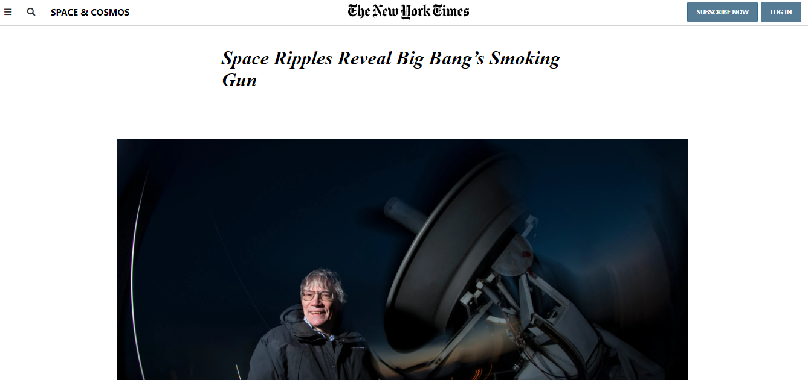

# New York Times Article

> This project required us to utilize many different CSS techniques to get it looking similar to the original. The article was pretty straight-forward but was a bit tricky when it came to the images that were wider than the article text. The footer was more time-consuming as it required us to use CSS Grid and try out different configurations. Overall it was a good learning experience and pushed us to use techniques that we hadn't tried before.



Additional description about the project and its features.

## Built With

- HTML
- CSS

## Live Demo

[Live Demo Link](https://antonyotero.github.io/nyt-webpage/)


## Getting Started

To get a local copy up and running follow these simple example steps.

### Prerequisites

- Live Server plugin for Visual Studio Code 

### Setup

1- Clone the repository
```
git clone https://github.com/elberthcorniell/Youtube-Clone.git
```

2- Open the folder on VS Code, right click the index.html file and click on "Open With Live Server"

3- Everything should be running by now. 


## Authors

👤 **Antony Otero**

- GitHub: [@AntonyOtero](https://github.com/AntonyOtero)
- Twitter: [@AntonyOtero](https://twitter.com/AntonyOtero)
- LinkedIn: [antonyotero](https://www.linkedin.com/in/antonyotero/)

👤 **Elbert Corniell**

- GitHub: [@elberthcorniell](https://github.com/elberthcorniell)
- Twitter: [@elberthcorniell](https://twitter.com/elberthcorniell)
- LinkedIn: [LinkedIn](https://www.linkedin.com/in/elbert-corniell-989183159/)

## 🤝 Contributing

Contributions, issues, and feature requests are welcome!

Feel free to check the [issues page](https://github.com/AntonyOtero/nyt-webpage/issues).

## Show your support

Give a ⭐️ if you like this project!

## Acknowledgments

- [@microverseinc](https://github.com/microverseinc)

## 📝 License

This project is [MIT](./LICENSE.md) licensed.
